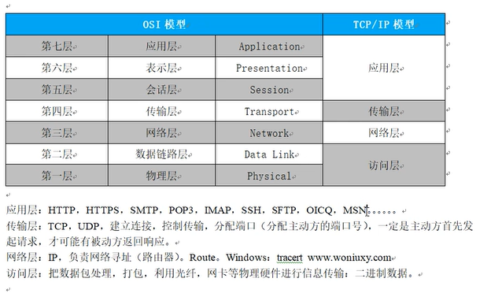
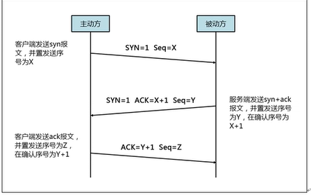

### Python TCP 详解

> * 界面
>   * 界面就是实现的是我们的用来实现用户实现操作实现的可视化的界面
> * 协议
>   * 协议：就是我们的预先实现定义好的规范，就是我们实现彼此之间遵守的具备一定约束性的一套标准
>   * 网络协议：预定义好的用于网络通信的一套规范，这个协议的实现是在我们的设备之间共同遵守
>   * 为什么会出现这种协议呐？？主要还是为了我们后续的便于理解，所以说我们的网络之间实现的交流，也是需要这种规范的
>     * 来实现我们的不同的设备之间可以实现以相同的一种规范来进行交流
>     * 只要是涉及到我们的通信的设备，这些都是需要实现遵循协议来实现通讯的
>   * `TCP（Transimission Control Protocol）` 传输控制协议具有三次握手，**实现了可靠，稳定的特性，但是性能低**
>   * `UDP（User Datagram Protocol）` 用户数据包协议没有三次握手，**不稳定不可靠，性能高**（视频通话）
> * 代码





* ACK 就是应答的意思Acknowleage
* TCP 的连接是全双工模式，所以说就要求我们的实现基本的两边的同意才可以执行某种行为
  * 所以说我们的 TCP 的连接层实现断开都是需要 4 次的挥手才可以实现

> 实现我们的自动化的测试的时候，我们的实现的就是对应用层实现测试的处理


> * 实现模拟我们的客户端发送请求服务器的过程含有
>   * 建立连接 `connect`
>   * 接收/发送数据 `/recvsend`
>   * 关闭连接 `close`
> * 一个中文汉字是占用的是 三个字节
>   * 为什么是三个字节呐？？？
>   * 这个是因为我们的一个字节代表的是八位
>   * 这个时候我们的三个字节可以实现表示的范围就是 2^32 的范围的语言文字
>   * 所以说就是使用的是三个字节了
> * 启动一个 TCP 服务器分为四步
>   * 实现绑定一个 IP 地址和端口号 `bind`
>   * 等待客户端的连接 `accept` 实现返回的是我们的 **conn** 连接对象和 **addr** 连接的地址
>   * 接收/发送数据 `recv/send`
>   * 关闭连接 `close`


### Python threading 线程的使用

> [threading 进程和线程 CSDN 博客详解](https://blog.csdn.net/weixin_41662255/article/details/144112049)
>
> 首先使用的方法是: 开辟我们的 python 的运行的线程
>
> `threading.Thread(target=target_func, args=(,)).start()`
>
> 同时我们还可以为我们的线程进行添加 `join 阻塞` 来守护我们的子线程，这个时候，我们的主线程就需要等待我们的子线程运行
>
> 完后才运行主线程中的代码，运行完后直接程序结束
>
> 在我们的实现爬虫的时候，我们为了可以识别我们的服务器给我们响应的数据类型，这个时候，就需要观测 `content-type` 的字段即可


### 数据库的使用（以关系型数据库 Mysql 为例子）

#### 数据库基础

> * 为什么使用数据库：
>   * 降低存储数据的冗余度
>   * 更高的数据一致性
>   * 存储的数据可以实现共享
>   * 可以建立数据库所遵循的规则
>   * 维护数据的完整性
>   * 保证数据的安全性
> * 数据库的发展历史
>   * 文件系统类型的数据库
>     * 就是将我们的数据文件保存在一个文件中进行保存的一种数据库模型
>   * 第一代的数据库
>     * 网状模型、层次模型的数据库
>   * 第二代的数据库
>     * 关系型的数据库和结构化的查询语言
>   * 第三代数据库
>     * 关系-对象型的数据库
> * 所有的数据库都是含有一个十分相同的一个点： 就是我们的 **sql** 语句 

#### 应用数据库操作

> * ##### 首先第一步打开自己的终端
>
>   * `mysql -uroot -p : 自己的数据库密码`
>   * 这种形式就可以实现我们的登录自己的数据库了
>
> * ##### 数据库的**显示、创建、删除**等操作
>
>   * 显示数据库含有那些
>
>     * `show databases;`  实现的是显示我们的当前系统具备的数据库含有那些
>
>   * 创建数据库的操作
>
>     * ```sql
>       create database database_name;
>       
>       // query ok 表示的就是我们的创建数据库成功
>       ```
>
>   * 删除数据库的操作
>
>     * `drop database database_name;`  实现的是删除指定的已经存在的数据库 
>
>   * 为了增强我们数据库操作的安全性，我们是可以在后面添加描述符: `if not exists` 或者说 `if exists` 的判断语句
>
>   * 注意我们的数据库操作的 sql 语句是不用区分大小写的
>
>   * ```sql
>     use demo;
>     drop database if exists demo;
>     create database if not exists demo;
>     show databases;
>     alter database demo character set = utf8;
>     ```
>
>   * 数据库操作的注释
>
>     * sql 数据库的注释是: `-- 需要进行注释的语句`   注意中间有一个空格，单行注释
>     * `/**/`  实现的是我们的多行注释
>
>   * 指定需要使用的数据库
>
>     * 指定我们的需要进行后续操作的数据库: `use database_name;`
>
>   * 同时有时候我们还需要修改数据库的编码集的操作
>
>     * `alter database database_name character set = charset_name;`
>     * `alter database database_name character set = utf8;`
>
> * ##### 数据库表的**删除、创建、查询、插入数据**等操作
>
>   * 现鼠当前数据库中含有的表
>
>     * `show tables;`  实现的是我们的显示当前所在数据库中存在的表有那些
>
>   * 创建表的操作
>
>     * `create table table_name (字段名 字段类型);`
>
>     * ```sql
>       show databases;  -- 显示数据库
>       drop database if exists demo;  -- 删除数据库
>       create database if not exists demo;  -- 创建数据库
>       show databases;
>       
>       use demo;  -- 使用数据库
>       
>       -- 开始实现我们的创建数据库表的操作
>       show tables;  -- 显示当前数据库含有的表
>       
>       -- 开始实现我们的创建数据库表的操作
>       create table table_name (
>       	id int,  -- 定义整型的 id 字段
>       	s_name varchar(20),  -- 定义可变的名称字符串，长度不过 20 的限度
>       	s_age int  -- 定义整型的 年纪
>       );
>       
>       show tables;
>       
>       /*
>       这个就是我们的sql 语句的多行注释
>       */
>       ```
>
>   * 删除表的操作
>
>     * `drop table if exists table_name;`
>
>     * ```sql
>       show databases;  -- 显示数据库
>       drop database if exists demo;  -- 删除数据库
>       create database if not exists demo;  -- 创建数据库
>       show databases;
>       
>       use demo;  -- 使用数据库
>       
>       -- 开始实现我们的创建数据库表的操作
>       show tables;  -- 显示当前数据库含有的表
>       
>       -- 开始实现我们的创建数据库表的操作
>       create table table_name (
>       	id int,  -- 定义整型的 id 字段
>       	s_name varchar(20),  -- 定义可变的名称字符串，长度不过 20 的限度
>       	s_age int  -- 定义整型的 年纪
>       );
>       
>       show tables;
>       
>       /*
>       这个就是我们的sql 语句的多行注释
>       */
>       
>       drop table if exists table_name;  -- 删除数据库的操作
>       
>       show tables;
>       ```
>
>   * ##### 数据库中的数据类型
>
>     * 整型 `int`
>     * 浮点型: `float | double`
>     * 自定义数据类型: `decimal(m,d)`

#### 数据库约束

#### 数据库设计

#### 数据库的增删改查操作

