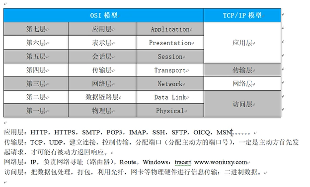

### Python TCP 详解

> * 界面
>   * 界面就是实现的是我们的用来实现用户实现操作实现的可视化的界面
> * 协议
>   * 协议：就是我们的预先实现定义好的规范，就是我们实现彼此之间遵守的具备一定约束性的一套标准
>   * 网络协议：预定义好的用于网络通信的一套规范，这个协议的实现是在我们的设备之间共同遵守
>   * 为什么会出现这种协议呐？？主要还是为了我们后续的便于理解，所以说我们的网络之间实现的交流，也是需要这种规范的
>     * 来实现我们的不同的设备之间可以实现以相同的一种规范来进行交流
>     * 只要是涉及到我们的通信的设备，这些都是需要实现遵循协议来实现通讯的
>   * `TCP（Transimission Control Protocol）` 传输控制协议具有三次握手，**实现了可靠，稳定的特性，但是性能低**
>   * `UDP（User Datagram Protocol）` 用户数据包协议没有三次握手，**不稳定不可靠，性能高**（视频通话）
> * 代码




* ACK 就是应答的意思Acknowleage
* TCP 的连接是全双工模式，所以说就要求我们的实现基本的两边的同意才可以执行某种行为
  * 所以说我们的 TCP 的连接层实现断开都是需要 4 次的挥手才可以实现

> 实现我们的自动化的测试的时候，我们的实现的就是对应用层实现测试的处理


> * 实现模拟我们的客户端发送请求服务器的过程含有
>   * 建立连接 `connect`
>   * 接收/发送数据 `/recvsend`
>   * 关闭连接 `close`
> * 一个中文汉字是占用的是 三个字节
>   * 为什么是三个字节呐？？？
>   * 这个是因为我们的一个字节代表的是八位
>   * 这个时候我们的三个字节可以实现表示的范围就是 2^32 的范围的语言文字
>   * 所以说就是使用的是三个字节了
> * 启动一个 TCP 服务器分为四步
>   * 实现绑定一个 IP 地址和端口号 `bind`
>   * 等待客户端的连接 `accept` 实现返回的是我们的 **conn** 连接对象和 **addr** 连接的地址
>   * 接收/发送数据 `recv/send`
>   * 关闭连接 `close`

---

---


### Python threading 线程的使用

> [threading 进程和线程 CSDN 博客详解](https://blog.csdn.net/weixin_41662255/article/details/144112049)
>
> 首先使用的方法是: 开辟我们的 python 的运行的线程
>
> `threading.Thread(target=target_func, args=(,)).start()`
>
> 同时我们还可以为我们的线程进行添加 `join 阻塞` 来守护我们的子线程，这个时候，我们的主线程就需要等待我们的子线程运行
>
> 完后才运行主线程中的代码，运行完后直接程序结束
>
> 在我们的实现爬虫的时候，我们为了可以识别我们的服务器给我们响应的数据类型，这个时候，就需要观测 `content-type` 的字段即可

---

---


### 数据库的使用（以关系型数据库 Mysql 为例子）


#### 数据库基础

> * 为什么使用数据库：
>   * 降低存储数据的冗余度
>   * 更高的数据一致性
>   * 存储的数据可以实现共享
>   * 可以建立数据库所遵循的规则
>   * 维护数据的完整性
>   * 保证数据的安全性
> * 数据库的发展历史
>   * 文件系统类型的数据库
>     * 就是将我们的数据文件保存在一个文件中进行保存的一种数据库模型
>   * 第一代的数据库
>     * 网状模型、层次模型的数据库
>   * 第二代的数据库
>     * 关系型的数据库和结构化的查询语言
>   * 第三代数据库
>     * 关系-对象型的数据库
> * 所有的数据库都是含有一个十分相同的一个点： 就是我们的 **sql** 语句 


#### 应用数据库操作

> * ##### 首先第一步打开自己的终端
>
>   * `mysql -uroot -p : 自己的数据库密码`
>   * 这种形式就可以实现我们的登录自己的数据库了
>
> * ##### 数据库的**显示、创建、删除**等操作
>
>   * 显示数据库含有那些
>
>     * `show databases;`  实现的是显示我们的当前系统具备的数据库含有那些
>
>   * 创建数据库的操作
>
>     * ```sql
>       create database database_name;
>       
>       // query ok 表示的就是我们的创建数据库成功
>       ```
>
>   * 删除数据库的操作
>
>     * `drop database database_name;`  实现的是删除指定的已经存在的数据库 
>
>   * 为了增强我们数据库操作的安全性，我们是可以在后面添加描述符: `if not exists` 或者说 `if exists` 的判断语句
>
>   * 注意我们的数据库操作的 sql 语句是不用区分大小写的
>
>   * ```sql
>     use demo;
>     drop database if exists demo;
>     create database if not exists demo;
>     show databases;
>     alter database demo character set = utf8;
>     ```
>
>   * 数据库操作的注释
>
>     * sql 数据库的注释是: `-- 需要进行注释的语句`   注意中间有一个空格，单行注释
>     * `/**/`  实现的是我们的多行注释
>
>   * 指定需要使用的数据库
>
>     * 指定我们的需要进行后续操作的数据库: `use database_name;`
>
>   * 同时有时候我们还需要修改数据库的编码集的操作
>
>     * `alter database database_name character set = charset_name;`
>     * `alter database database_name character set = utf8;`
>
> * ##### 数据库表的**删除、创建、查询、插入数据**等操作
>
>   * 现鼠当前数据库中含有的表
>
>     * `show tables;`  实现的是我们的显示当前所在数据库中存在的表有那些
>
>   * ###### 创建表的操作
>
>     * `create table table_name (字段名 字段类型);`
>
>     * ```sql
>       show databases;  -- 显示数据库
>       drop database if exists demo;  -- 删除数据库
>       create database if not exists demo;  -- 创建数据库
>       show databases;
>       
>       use demo;  -- 使用数据库
>       
>       -- 开始实现我们的创建数据库表的操作
>       show tables;  -- 显示当前数据库含有的表
>       
>       -- 开始实现我们的创建数据库表的操作
>       create table table_name (
>       	id int,  -- 定义整型的 id 字段
>       	s_name varchar(20),  -- 定义可变的名称字符串，长度不过 20 的限度
>       	s_age int  -- 定义整型的 年纪
>       );
>       
>       show tables;
>       
>       /*
>       这个就是我们的sql 语句的多行注释
>       */
>       ```
>
>   * ###### 删除表的操作
>
>     * `drop table if exists table_name;`
>
>     * ```sql
>       show databases;  -- 显示数据库
>       drop database if exists demo;  -- 删除数据库
>       create database if not exists demo;  -- 创建数据库
>       show databases;
>       
>       use demo;  -- 使用数据库
>       
>       -- 开始实现我们的创建数据库表的操作
>       show tables;  -- 显示当前数据库含有的表
>       
>       -- 开始实现我们的创建数据库表的操作
>       create table table_name (
>       	id int,  -- 定义整型的 id 字段
>       	s_name varchar(20),  -- 定义可变的名称字符串，长度不过 20 的限度
>       	s_age int  -- 定义整型的 年纪
>       );
>       
>       show tables;
>       
>       /*
>       这个就是我们的sql 语句的多行注释
>       */
>       
>       drop table if exists table_name;  -- 删除数据库的操作
>       
>       show tables;
>       ```
>
>   * ###### 数据库表中的数据类型
>
>     * 我们的关系型数据库的话，如果需要定义一个字段的话，这个时候就需要实现的是`字段名 数据类型`
>     * 整型 `int | bigint`
>     * 浮点型: `float | double`
>     * 自定义数据类型: `decimal(m,d)` m 表示的总的位数，d表示的是小数位数
>     * 字符串的数据类型: `char(n) | varchar(n)`
>       * 字符串的话必须记录我们的字符串的 **length**
>       * **text** 就是表示的是文本的数据类型
>     * 二进制数据类型
>     * 日期的数据类型
>       * **year** 年的数据类型
>       * **date** 日期的数据类型
>       * **month** 月的数据类型
>       * **time** 时间的数据类型
>       * **datetime** 时间的数据类型
>     
>   * 显示表的创建源码 
>   
>     * `show create table table_name;` 显示表的定义
>     * 数据库的引擎就是我们的 **innodb**
>   
>   * ```sql
>     create database if not exists demo;  -- 创建数据库当数据库不存在的时候
>     use demo;  -- 实现指定我们使用的数据库 demo
>     
>     create table if not exists demo_02 ( -- 创建表的操作
>     	age int,
>     	name varchar(20),
>     	id int,
>     	birthday datetime
>     );
>     
>     show tables;
>     
>     insert into demo_02 VALUES(11, "cdsdsc", 2, "1001-12-11 11-11-11");
>     ```


#### 数据库约束

> * 通过数据库的约束来实现保证我们的数据库中的数据插入的正确性，这样就可以实现简介性的保证数据的正确性或者唯一性
>
> * 数据的完整性或者说数据的正确性的含有下面的几个概念
>
>   * **域完整性** 
>   * **实体完整性**  
>   * **自定义完整性**
>   * **参照完整性**
>
> * 我们的数据的含有的约束含有:
>
>   * **唯一约束**
>
>     * **`unique`**
>
>   * **检查约束**
>
>     * **`set("男", "女")`**
>     * **`enum("值一", "值二"...)`** 枚举类型
>
>   * **自增约束**
>
>     * **`auto_increment`**
>
>   * **非空约束**
>
>     * **`not null`**
>
>   * **默认值约束**
>
>     * **`default 默认值`**
>
>   * **主键约束**
>
>     * 主键的话原本就是具备了两个特征的，一个就是**唯一性以及非空性 `unique not null`**
>     * 用于实现的是区分我们的每个记录之间的不同
>     * 就是一种编号，实现的就是我们的一种区分吧
>     * **`primary key`**
>
>   * **外键约束**
>
>     * 外键约束就是实现的是我们的添加一些外键字段实现我们的一些内在联系
>     * `foreign key`
>
>   * ```sql
>     -- 首先创建两个表，其中表A包含主键，表B包含外键
>     CREATE TABLE table_A (
>         id INT PRIMARY KEY,
>         name VARCHAR(50)
>     );
>     
>     CREATE TABLE table_B (
>         id INT,
>         a_id INT,
>         FOREIGN KEY (a_id) REFERENCES table_A(id)
>     );
>     
>     -- 使用ALTER TABLE语句为表B添加外键约束
>     ALTER TABLE table_B ADD CONSTRAINT fk_a_id FOREIGN KEY (a_id) REFERENCES table_A(id);
>     
>     -- alert table 子表名 add constraint 约束名 foreign key(子表中被约束的字段) references 父表(父表字段)
>     ```
>
>   * ```sql
>     CREATE TABLE table_A (
>         id INT PRIMARY KEY,
>         name VARCHAR(50)
>     );
>     
>     CREATE TABLE table_B (
>         id INT,
>         a_id INT,
>         FOREIGN KEY (a_id) REFERENCES table_A(id) ON DELETE CASCADE  -- 就是级联的意思
>     );
>     ```
>
>   * ```sql
>     CREATE TRIGGER check_fk BEFORE INSERT ON table_B
>     FOR EACH ROW
>     BEGIN
>         IF NOT EXISTS (SELECT 1 FROM table_A WHERE id = NEW.a_id) THEN
>             SIGNAL SQLSTATE '45000'
>             SET MESSAGE_TEXT = 'Invalid foreign key value';
>         END IF;
>     END;
>     ```
>
>   * [观看资料](https://www.php.cn/faq/710318.html)
>
>   * **`alert table 子表名 add constraint 约束名 foreign key(子表中被约束的字段) references 父表(父表字段)`**


#### 数据库设计规范

> * 数据库的设计原则： 尽量少用约束，因为约束越多，我们的数据的检查就会大大的减少性能，从而得到性能大大的提升
>
>   * 把数据库的检查约束直接在前端或者后端中进行检测，因为我们的代码的运行效率是很快的
>
>   * 数据库的设计，尽量减少对数据库压力的减少，这个就是我们的数据库设计的原则一
>
>   * ```sql
>     create database if not exists my_demo;  -- 实现的是创建数据库
>     use my_demo;  -- 使用数据库，保证接下来的操作全部是在该数据库中进行操作的
>     
>     drop table if exists prtInfo;  -- 如果表存在直接及逆行删除即可
>     create table if not exists prtInfo(  -- 创建数据库表的操作
>     	pid int primary key auto_increment,  -- 添加主键约束，并且是自增的
>     	pname varchar(20) not null,
>     	ptype varchar(30),
>     	page int not null,
>     	pbirthday date not null
>     );
>     -- alter table prtInfo add constraint pk_pid primary key(pid);  -- 添加主键约束
>     
>     
>     drop table if exists eInfo;
>     create table if not exists eInfo(  -- 创建第二个表
>     	eid int,
>     	pid int not null,
>     	edate date not null,
>     	vid int not null
>     );
>     -- 开始实现添加主键
>     alter table eInfo add constraint pk_eid primary key(eid);
>     -- 开始实现添加两个表的外键关联
>     alter table eInfo add constraint fk_pid foreign key(pid) references prtInfo(pid) on DELETE CASCADE;
>     
>     
>     drop table if exists vaccine;
>     create table vaccine(  -- 实现创建第三张表
>     	vid int primary key,
>     	vname varchar(30) not null,
>     	v_date date
>     );
>     -- 再实现添加一个外键约束
>     alter table eInfo add constraint fk_vid foreign key(vid) references vaccine(vid) on DELETE CASCADE;
>     ```
>
>   * 上面的数据库设计就是实现了我们的
>
>     * 第一个表中含有一个主键
>     * 第二个表中含有一个主键两个关联父表的外键
>     * 第三个表创建了一个主键，用于和第二个表进行关联
>     * mysql 数据库中，**我们一个表中的主键只能有一个，但是我们的外键可以有多个**，我个人感觉这个也是数据库设计时候
>       * 需要注意的一个点吧
>
> * 软件开发流程设计中，我们的设计步骤具有包含三种:
>
>   * 客户提出需求，项目立项
>   * 需求调研，生成需求规则说明书 SRS
>   * 软件设计
>     * **概要设计**，确定一个软件含有那些主要的功能模块
>     * **数据库设计**， 数据库设计主要是实现我们对数据的一些处理的一种设计
>     * **详细设计**
>   * 前后端进行编码实现详细设计
>   * 然后进行测试，实现我们的找到软件具有的一些明显问题，以及解决问题
>   * 试运行和上线以及维护
>
> * 我们开发人员主要注重的就是数据库设计
>
>   * 用户管理功能的设计
>   * 考虑每一个数据库中的表的设计，每个表之间的联系
>   * 


#### 数据库的增删改查操作

##### 基本的一些数据库操作

> * 注意我们的对数据库的操作的话，如果进行的**增加、删除、修改**的操作，我们是需要进行**提交事务的 `commit`**
> * **插入数据**
>   * **`insert into 表名 [(字段名)] values (数据);`**
>     * 注意事项： 字段名个数和数据的个数一定要保证一致
>     * 对于一些自增的字段不用手动的添加字段值
>     * 如果值为默认值，我们是可以直接添加 default 字段的，这个时候就是使用的是我们的默认值替换
>   * **`insert into 备份表(字段) select (字段名) from 原本的表;`**
>     * 这样就可以实现我们的查询式的插入数据
>     * `commit` 提交事务
>   * **`insert into 表名 (字段名) values (数据集1), (数据集2)...`**
> * **更新数据**
>   * **`update 表名 set 需要修改的表字段1=更新后的值1,... 条件语句;`**
>     * 条件语句的添加是为了精确的实现更新数据库中的数据，条件语句就是进行的过滤操作
>     * `where 表中的具有标识的字段=原本表中的数据;`
>     * 最后进行 `commit` 提交事务
> * **删除数据**
>   * **`delete from 表名 条件判断`**
>     * 我们进行表中的数据的时候，我们任然是需要进行添加判断条件来进行删除的过滤操作
>     * 最后任然还是需要进行提交事务的 `commit`  提交事务
> * **查询数据**
>   * **精确查询**
>     * **`select * from 表名`**
>       * `*` 是我们的通配符，这个时候，我们就可以实现的是将一个表中的数据全部查询出来了
>     * **`select * from 表名 where 表中具备的字段名=对应的值;`**
>       * 这个就是我们的**等值查询**，查询出满足条件的值
>     * **`select * from 表名 where 表中具备的字段!=对应的值;`**
>       * 这个就是我们的**不等值查询**
>     * **`select 字段名 from 表名 条件判断`**
>       * 逻辑与查询
>         * 这里的范围条件可以是 `> | < | >= | <=` ，含有多个判断条件进行连接的时候，可以使用 `and` 进行拼接
>         * 同时我们还是可以使用 `between...and`，区间的话是闭区间 `[]`
>       * 数据为空查询
>         * 同时我们的数据为空的判断条件可以是 `="" | is null | is not null`
>       * 逻辑或查询
>         * 同时还有我们的 `or` 关键字来实现代表我们的**并集操作**
>         * `in (值1, 值2...)` 通过这样的语句可以一样的和 `or` 一致的操作
>       * 这个就是实现的是查询出我们的满足条件的对应字段信息
>   * **模糊查询**
>     * **`select * from 表名 where 表中具有的字段名 like "%具有的值%";`**
>       * `%`  表示的是 零个或者多个字符
>   * **别名查询**
>     * **`select title as 书名, publish as 出版社 from 表`**
>       * `as` 语句就是实现的是起别名的操作 
>       * `as` 还可以省略，但是为了标准，尽量还是写吧
>   * **分页查询**
>     * **`select * from 表名 limit 0, 5`**
>       * 这个语句就是表示的是获取前五个查询到的数据，**第一个数字是起始下标，第二个数字是查询的步长**
>       * 这个就是使用的是 **`limit` 关键字**
>   * **去重查询**
>     * **`select distinct 字段名 from 表名;`**
>       * 实现我们的去重查询的话，我们是可以直接使用 `distinct` 关键字实现的
>       * 通过这个关键字，我们就可以实现简单的去重操作了
>   * **排序查询**
>     * **`select * from 表名 order by 表中具备的字段名 asc|desc`**
>       * `asc` 或者 `desc` 前者是默认的从低到高排序，后者是从高到低排序

##### 数据库的进阶操作

> * **聚合函数查询**
>
>   * **`select 聚合函数名(字段名) from 表名;`**
>     * **count** 实现的是返回结果集中所有值的数目
>     * **sum** 返回查询结果集中所有值的总和
>     * **avg** 返回结果集中所有值的平均值
>     * **max** 实现的返回结果集中所有值的最大值
>     * **min** 实现的是返回结果集中所有值的最小值
>
> * **分组查询**
>
>   * **`select 字段名 from 表名 group by 指定根据什么字段名分组`**
>     * 实现我们的分组查询就是使用的是 `group by` 来实现指定我们根据什么来实现分组查询
>     * 使用分组查询的时候，除了分组查询字段和聚合函数外，其他的字段查询尽量不要混入查询，否则报错
>   * 分组之后我们进行过滤的话就需要使用我们的 **having** 关键字来实现过滤操作，其可以使用句和函数进行过滤
>   * 多个过滤语句的书写顺序
>     * **`select 查询内容 from 表名 where 条件判断 group by 字段名 having 分组后的再次过滤 order by 排序依据字段 limit 分页操作`**
>
> * **日期函数**
>
>   * **`year(日期字段)`** 就可以获取得到我们的日期的年份了
>   * **`now()`** 实现的是就是获取的当前的时间，查询的表是 **`dual`** 表来实现指代我们的时间表
>     * **`select year(now()) - year(时间字段) from 表名`**
>   * **`day(now())`** 实现获取的是当前的日期
>   * **`month(now())`** 实现获取的是当前的月份
>   * **[其他的关于时间的sql语句操作](https://blog.csdn.net/WL456258/article/details/134884445)**
>
> * **子查询**
>
>   * 子查询就是把其他的查询语句当作一个查询语句的条件来进行使用，这个就是子查询
>   * 同时这里需要满足的是**父查询和子查询的条件过滤字段和子查询字段名一致**，这是基本的要求
>   * **`= | in`** 的使用，但是为了保险，子查询可以统一使用 **`in`** 因为这个不仅仅可以判断一行，还可以是多行
>     * **`seletc sname from student where o in (select o from score where o > 10) limit 0, 5;`**
>   * **子查询和 exists 之间的联合查询**
>     * **`select sname from student as stu where exists (select * from score as sco where stu.o=sco.o;)`**
>     * **这个和后面的连表查询的思维类似，注意起别名**
>   * `any | all` 语句查询
>     * **any** 表示和查询的结果的任意值比较
>     * **all** 表示和最值进行比较
>
> * **关联查询（这个时候可能导致笛卡尔积）【所以说我们就需要一定的条件进行过滤，这个就是相同字段间的关系问题】**
>
>   * 关联查询分为我们的 **内关联查询** 和 **外关联查询**
>
>   * 我们的标准的写法是使用我们的 **join** 连接两张表
>
>   * **`select sname, cno from student s, score c where s.sno in (select sno from score where degree is not null) and s.sno = c.sno;`**
>
>   * **[关联查询语句的博客](https://blog.csdn.net/wjl990316fddwjl/article/details/135732939)**
>
>   * ```sql
>     SELECT employee_id, department_name
>     FROM employees e
>     INNER JOIN departments d ON e.department_id = d.department_id;
>     ```
>
>   * ```sql
>     SELECT employee_id, department_name
>     FROM employees e
>     LEFT JOIN departments d ON e.department_id = d.department_id;
>     ```
>
>   * ```sql
>     SELECT department_id, employee_id, employee_name
>     FROM departments d
>     RIGHT JOIN employees e ON d.department_id = e.department_id;
>     ```

#### 还可以自己拓展使用 `触发器 游标  事务 视图`

```sql
create database if not exists library;  -- 创建数据库
use library;  -- 使用数据库

create table if not exists bookType(  -- 创建表
	typeid int primary key,
	typeName varchar(20)
);


create table if not exists readerType(  -- 创建第二张表
	retypeId int unique not null ,
	readerName varchar(20) not null,
	borrowquantity int not null,
	borrowday int
);


create table if not exists book(  -- 建立第三张表
	bookId char(10) primary key,
	bookName varchar(20) not	null,
	typeid int,
	bookauthor varchar(20),
	bookPublihser	varchar(20),
	bookPrice double,
	borrowsum int,
	foreign key (typeid) REFERENCES booktype(typeId)
);

create table if not exists bookStorage(  -- 创建第三张表
	bookbarcode char(20) primary key,
	bookId char(10) not null,
	bookInTime dateTime,
	bookStatus varchar(4),
	FOREIGN key (bookId) REFERENCES book(bookid)
);

create table if not exists reader(  -- 创建第四章表
	readerid char(10) PRIMARY key,
	readername char(20) not null,
	readerpass varchar(20) not null,
	retypeid int ,
	readerdate datetime,
	readerstatus varchar(4),
	FOREIGN key (reTypeId) REFERENCES readerType(retypeId)
);


create table if not exists bookborrow(  -- 创建第五张表
	borrowid char(10) primary key,
	bookbarcode char(20) not null,
	readerid char(10) not null,
	borrowtime datetime,
	returntime datetime,
	borrowstatus varchar(4),
	FOREIGN key (bookBarCode) REFERENCES bookStorage(bookBarCode), 
	FOREIGN key (readerId) REFERENCES reader(readerId)
);

-- 开始实现添加数据
insert into booktype VALUES
(1, "自然科学"),
(2, "数学"),
(3, "计算机"),
(4, "建筑水利"),
(5, "旅游地理"),
(6, "励志/自我实现"),
(7, "工业技术"),
(8, "基础医学"),
(9, "室内设计"),
(10, "人文景观");

insert into book values
('TP39/1712','Java程序设计',3,'陈永红','机械工业出版社',35.5,30),
('013452','离散数学',2,'张小新','机械工业出版社',45.5,10),
('TP/3452','JSP程序设计案例',3,'刘城清','电子工业出版社',42.8,8),
('TH/2345','机械设计手册',7,'黄明凡','人民邮电出版社',40,10),
('R/345677','中医的故事',8,'李奇德','国防工业出版社',20.0,5);


insert into bookstorage values
('132782','TP39/1712','2009-08-10 00:00:00','在馆'),
('132789','TP39/1712','2009-08-10 00:00:00','借出'),
('145234','013452','2008-12-06 00:00:00','借出'),
('145321','TP/3452','2007-11-04 00:00:00','借出'),
('156833','TH/2345','2009-12-04 00:00:00','借出'),
('345214','R/345677','2008-11-03 00:00:00','在馆');


insert into readertype values
(1,'学生',10,30),
(2,'教师',20,60),
(3,'管理员',15,30),
(4,'职工',15,20);

insert into reader values
('0016','苏小东',123456,1,'1999-09-09 00:00:00','有效'),
('0017','张明',123456,1,'2010-09-10 00:00:00','有效'),
('0018','梁君红',123456,1,'2010-09-10 00:00:00','有效'),
('0021','赵清远',123456,2,'2010-07-01 00:00:00','有效'),
('0034','李瑞清',123456,3,'2009-08-03 00:00:00','有效'),
('0042','张明月',123456,4,'1997-04-23 00:00:00','有效');

insert into bookborrow values
('001328','132789','0017','2011-01-24 00:00:00','2011-02-28 00:00:00','已还'),
('001356','145234','0018','2011-02-12 00:00:00','2011-02-27 00:00:00','已还'),
('001432','132782','0016','2011-03-04 00:00:00','2011-04-05 00:00:00','已还'),
('001435','145321','0021','2011-08-09 00:00:00','2011-09-02 00:00:00','已还'),
('001578','156833','0034','2011-10-01 00:00:00','2011-11-01 00:00:00','未还'),
('001679','345214','0042','2011-02-21 00:00:00','2011-03-05 00:00:00','未还');

-- 开始实现查询
select bookid, bookName,borrowsum from book;

select bookid as "书号",bookName as 书名, borrowsum as 接触数量 from book;

-- 子查询一
select * from reader where retypeid = (select retypeid from readertype where readerName = "学生");

-- 范围查询三
select bookBarcode from bookBorrow where borrowtime
>= "2011-03-01" and returnTime <= "2011-10-1";

-- 子查询二
select * from reader where
retypeid in ((select retypeid from readerType where readerName = "学生"),
(select retypeid from readerType where readerName = "教师"));

-- 模糊查询
select * from book where bookName like "%程序%";

-- 排序查询 + 分页查询
select * from book order by borrowSum desc limit 3;

-- 多个排序查询
select * from book order by borrowSum desc, bookprice desc;

-- 分页查询
select bookName, bookPrice from book limit 1,5;

-- 连表查询
select * from bookborrow as a1 LEFT JOIN reader as a2 on a1.readerId = a2.readerid;


select count(bookBarcode) as
sumBook from bookborrow as a1 LEFT JOIN reader as a2 on a1.readerId = a2.readerid GROUP BY retypeid;

select avg(bookprice) as 平均价格 from book group by bookpublihser;

select readerName, bookid, borrowTime, returnTime from bookborrow as b1
left join reader as b2 on b1.readerid = b2.readerid left join bookstorage as b3
on b1.bookbarcode = b3.bookbarcode where b1.readerid = "0021" ;

select readerName, bookName, borrowTime returnTime from bookborrow as b1
left join bookstorage as b2 on b1.bookbarcode = b2.bookbarcode
left join reader as b3 on b1.readerid = b3.readerid left join book as b4 on b2.bookid = b4.bookid;

select * from bookstorage as a1
left JOIN bookborrow as a2 on a1.bookbarcode = a2.bookbarcode
left join reader as a3 on a2.readerid = a3.readerid where bookstatus = '借出';
```

